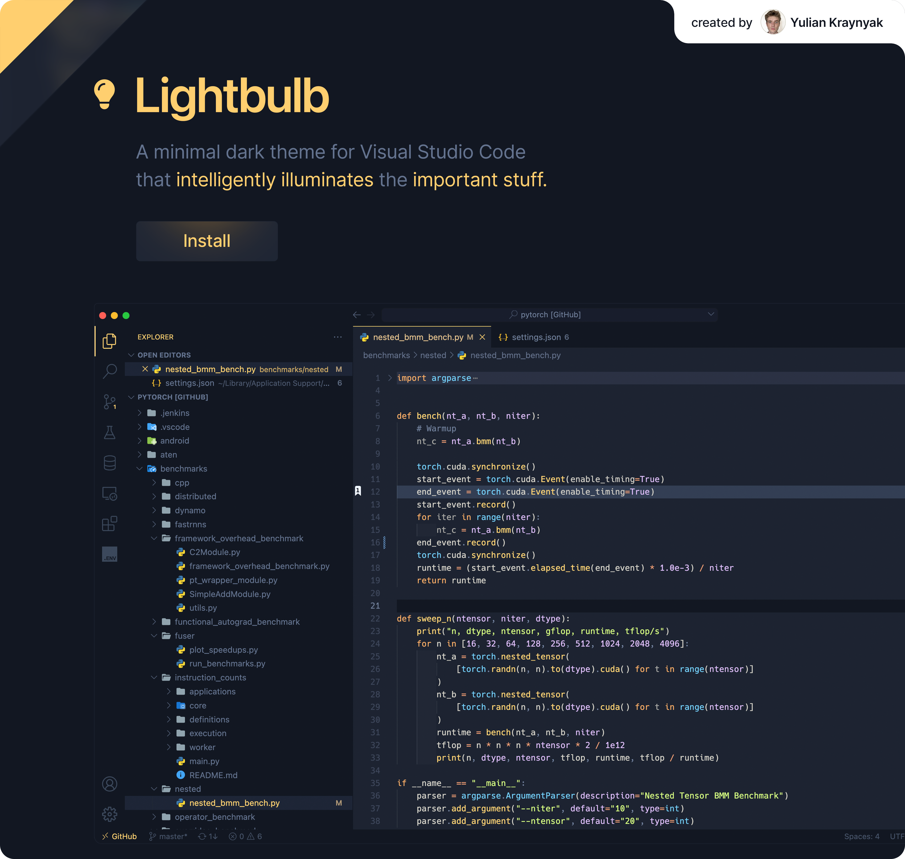

# 💡 Lightbulb

<a href="https://marketplace.visualstudio.com/items?itemName=ykray.lightbulb">
    
</a>

<br/>

[Install from the Visual Studio Marketplace](https://marketplace.visualstudio.com/items?itemName=ykray.lightbulb)

## 💡 Concept

Lightbulb is a minimal dark theme for Visual Studio Code that intelligently illuminates items of interest, while elegantly fading away unnecessary distractions.

This is a comprehensive theme designed over many years of experimentation with my own VS Code setup, with the goal of a design that increases productivity but is also nice to just _look_ at. **Bright actions** on **subtle surfaces**, lit up by **intuitive colors**. I hope you enjoy this theme as much as I enjoy tinkering on it.

## Setup (optional)

Lightbulb is good-to-go upon install, but here's some recommended stuff to do to get the most out of it.

### 1. Recommended font: `Hack Nerd Font Mono`

### 2. Resize sidebar:

- Set `"window.zoomLevel": 0.45`
- Set `"editor.fontSize": 13`
- Set `"workbench.editor.wrapTabs": false`

### 3. Hide the title bar

1. Install the [Customize UI](https://marketplace.visualstudio.com/items?itemName=iocave.customize-ui) extension
2. Set `"customizeUI.titleBar": "inline"`

### 4. Style TODOs

1. Install the [TODO Highlight](https://marketplace.visualstudio.com/items?itemName=wayou.vscode-todo-highlight) extension
2. Set

```jsonc
"todohighlight.keywords": [
    {
      "backgroundColor": "#ffcf6f",
      "overviewRulerColor": "#ffcf6f",
      "text": "TODO"
    },
    {
      "backgroundColor": "#f98d7c",
      "overviewRulerColor": "#f98d7c",
      "text": "ERROR"
    }
    //  ...
]}
```

## ✨ Extras

Lightbulb also styles the following extensions (if installed):

- [Numbered Bookmarks](https://marketplace.visualstudio.com/items?itemName=alefragnani.numbered-bookmarks)
- [GitLens](https://marketplace.visualstudio.com/items?itemName=eamodio.gitlens)

## 🤨 Missing colors?

Can't get em all. Feel free to suggest styling suggestions by [creating an issue](https://github.com/ykray/Lightbulb/issues).

---

Inspired by _Ayu Mirage_ and _Field Lights_.
