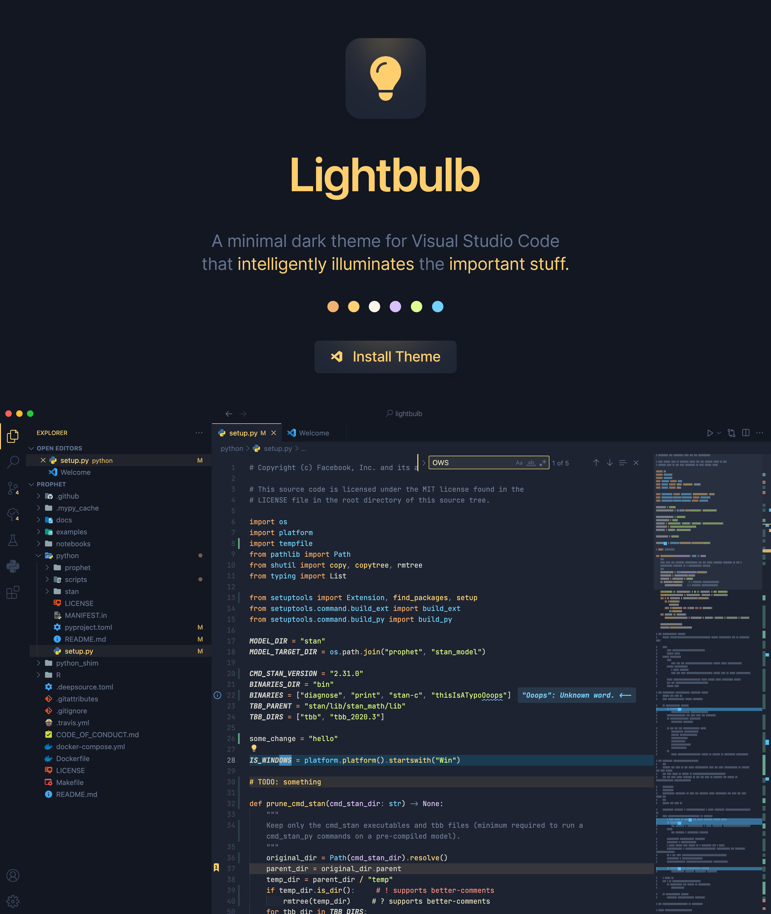

# 💡 Lightbulb

<a href="https://marketplace.visualstudio.com/items?itemName=ykray.lightbulb">
    
</a>

<br/>

## Philosophy

**Bright actions** on **subtle surfaces**, lit up by an **intuitive palette** of colors.

Lightbulb is a minimal dark theme for Visual Studio Code that intelligently illuminates items of interest, while elegantly fading away unnecessary distractions.

This is a comprehensive theme designed over many years of experimentation with my own VS Code setup, with the goal of a design that increases productivity (but is also nice to just stare at).

[Install Lightbulb](https://marketplace.visualstudio.com/items?itemName=ykray.lightbulb)

---

## Setup (recommended)

Lightbulb is good to go upon install, but here are some recommended customizations (from your end) to make it _really_ pop.

#### Install [Helium Icons](https://marketplace.visualstudio.com/items?itemName=helgardrichard.helium-icon-theme) (pair nicely)

#### Install [JetBrains Mono](https://www.jetbrains.com/lp/mono/) and set:

```jsonc
{
    "editor.fontFamily": "JetBrains Mono",
    "editor.fontLigatures": true,
    "editor.fontSize": 13,
    "editor.fontWeight": 400
}
```

#### Install [Better Comments](https://marketplace.visualstudio.com/items?itemName=aaron-bond.better-comments) and set:

```json
{
    "better-comments.tags": [
        {
            "backgroundColor": "transparent",
            "bold": false,
            "color": "#f88f7f",
            "italic": true,
            "strikethrough": false,
            "tag": "!",
            "underline": false
        },
        {
            "backgroundColor": "transparent",
            "bold": false,
            "color": "#9ca9bf",
            "italic": true,
            "strikethrough": false,
            "tag": "?",
            "underline": false
        },
        {
            "backgroundColor": "transparent",
            "bold": false,
            "color": "#ffcf6f",
            "italic": true,
            "strikethrough": false,
            "tag": "*",
            "underline": false
        }
    ]
}
```

#### Install [Error Lens](https://marketplace.visualstudio.com/items?itemName=usernamehw.errorlens) and set:

```jsonc
{
    "errorLens.borderRadius": "0px",
    "errorLens.fontSize": "1em",
    "errorLens.fontStyleItalic": true,
    "errorLens.fontWeight": "500",
    "errorLens.gutterIconSet": "default",
    "errorLens.gutterIconSize": "66%",
    "errorLens.gutterIconsEnabled": true,
    "errorLens.margin": "1.5ch",
    "errorLens.messageBackgroundMode": "message",
    "errorLens.messageTemplate": "$message <$source($code)",
    "errorLens.padding": "0.034ch 0.6ch"
}
```

> **Note** (advanced)<br/>
> To change the gutter icon colors:
>
> 1. Open `~/.vscode/extensions/usernamehw.errorlens-<version>/img`
> 2. Edit the `fill` of the corresponding SVGs, or replace with some other SVG

#### Install [Indent Rainbow](https://marketplace.visualstudio.com/items?itemName=oderwat.indent-rainbow) and set:

```json
{
    "indentRainbow.colors": ["#33425900", "#3342592a"],
    "indentRainbow.errorColor": "#f88f7f29",
    "indentRainbow.indicatorStyle": "classic"
}
```

#### Install [TODO Highlight](https://marketplace.visualstudio.com/items?itemName=wayou.vscode-todo-highlight) and set:

```json
{
    "todohighlight.enableDiagnostics": true,
    "todohighlight.defaultStyle": {
        "backgroundColor": "transparent",
        "color": "#121722",
        "fontStyle": "",
        "fontWeight": "normal",
        "isWholeLine": true,
        "overviewRulerColor": "#ffcf6f"
    },
    "todohighlight.keywords": [
        {
            "backgroundColor": "#dcd8bb12",
            "color": "#ffcf6f",
            "overviewRulerColor": "#ffcf6f",
            "text": "TODO"
        }
    ]
}
```

#### Install [Coverage Gutters](https://marketplace.visualstudio.com/items?itemName=ryanluker.vscode-coverage-gutters) and set:

```json
{
    "coverage-gutters.highlightdark": "#42f1b425",
    "coverage-gutters.noHighlightDark": "#f88f7f25",
    "coverage-gutters.partialHighlightDark": "#dcd8bb25"
}
```

> **Note** (advanced)<br/>
> To change the gutter icon colors:
>
> 1. Open `~/.vscode/extensions/ryanluker.vscode-coverage-gutters-<version>/app_images`
> 2. Edit the `fill` of the corresponding SVGs, or replace with some other SVG

---

## Extras

Built-in support for semantic highlighting, as well as styling for the following extensions:

-   [Error Lens](https://marketplace.visualstudio.com/items?itemName=usernamehw.errorlens)
-   [Numbered Bookmarks](https://marketplace.visualstudio.com/items?itemName=alefragnani.numbered-bookmarks)
-   [GitLens](https://marketplace.visualstudio.com/items?itemName=eamodio.gitlens)
-   [Inline Parameters](https://marketplace.visualstudio.com/items?itemName=liamhammett.inline-parameters)

---

## Missing colors?

> Report missing styles — [create an issue](https://github.com/ykray/Lightbulb/issues)

> Suggest changes — [submit an idea](https://github.com/ykray/Lightbulb/discussions/categories/ideas)

---

Inspired by _Ayu Mirage_ and _Field Lights_
